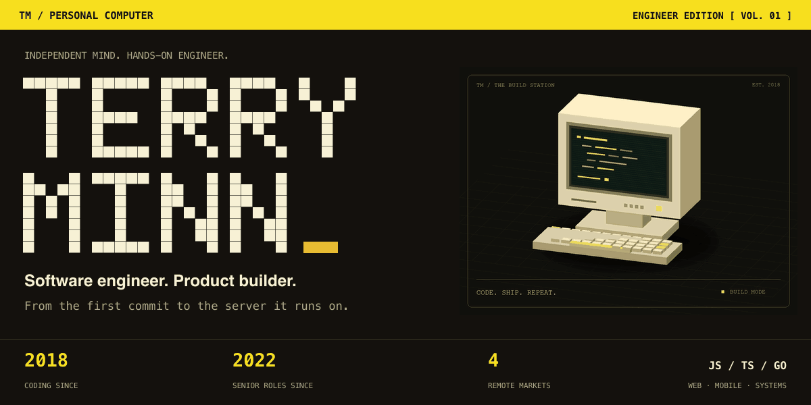
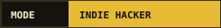
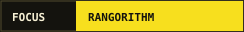
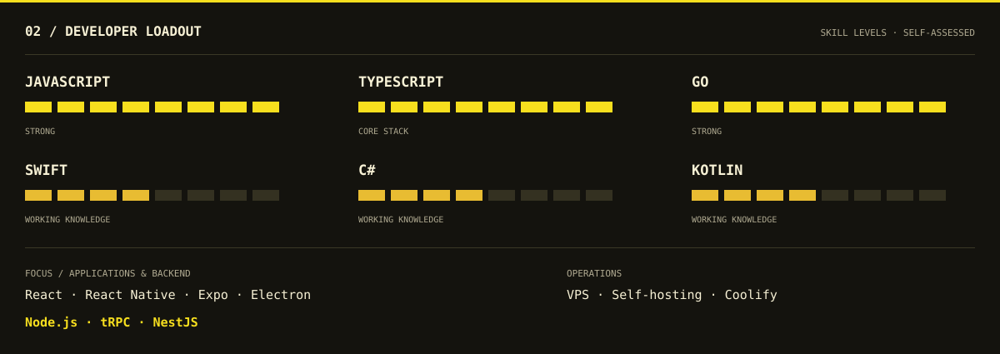
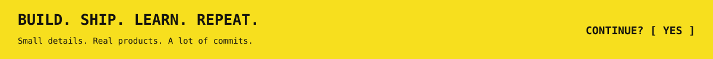

  

  
  
  

 

## 🕹️ Developer loadout

 

## 📡 Say hello

Interested in product engineering, developer tools, or building something useful? Let's talk.

**[✉️ Email](mailto:devwithterry@gmail.com)** &nbsp; · &nbsp; **[👾 GitHub](https://github.com/TerryMinn)** &nbsp; · &nbsp; **[🚀 Rangorithm](https://www.facebook.com/rangorithm/)**

 

CRAFTED WITH CURIOSITY &nbsp; ✳ &nbsp; POWERED BY A LOT OF COMMITS

