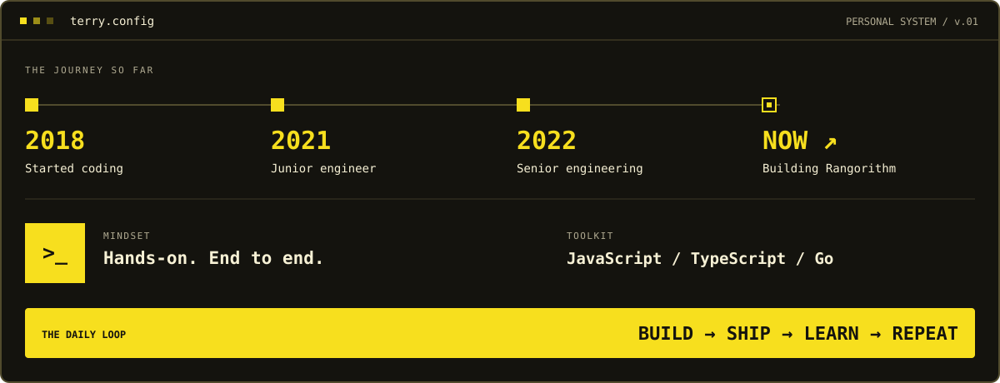

  

  
  
  

 

## 👾 01 / The human behind the keyboard

### Hey, I'm Terry. 👋

> **I build products and manage the infrastructure behind them.**

I work across **web, mobile, desktop, and backend systems**, with hands-on experience **setting up, deploying, and operating the infrastructure behind them**. I take ownership across application development, server management, and ongoing infrastructure operations.

🚀 Today, I'm an **indie hacker building Rangorithm**, turning ideas into products and staying close to the code.

**🌏 REMOTE EXPERIENCE**  
🇯🇵 Japan &nbsp; · &nbsp; 🇭🇷 Croatia &nbsp; · &nbsp; 🇸🇬 Singapore &nbsp; · &nbsp; 🇰🇷 Korea

 

## 🕹️ 02 / Developer loadout

 

## 📡 03 / Say hello

Interested in product engineering, developer tools, or building something useful? Let's talk.

**[✉️ Email](mailto:devwithterry@gmail.com)** &nbsp; · &nbsp; **[👾 GitHub](https://github.com/TerryMinn)** &nbsp; · &nbsp; **[🚀 Rangorithm](https://www.facebook.com/rangorithm/)**

 

CRAFTED WITH CURIOSITY &nbsp; ✳ &nbsp; POWERED BY A LOT OF COMMITS

